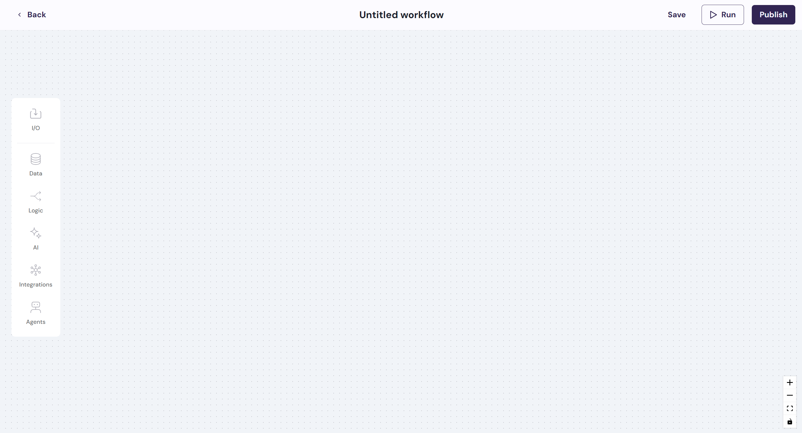
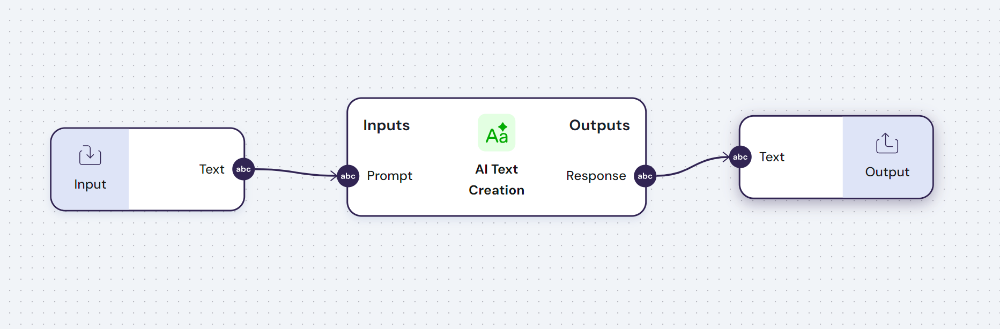

## 1. What is it?

The workflow builder is one of the core tools in Spot's platform. This is where you build, run, deploy and share your AI workflows and tools.

To access the workflow builder you should click on "Create New Flow" on the page "My flows".

The workflow builder is composed by the **Navigation Bar** - where you can find all the components to build your workflow - and the **Top Bar** - where you can Run and Publish your workflow.

## 2. Navigation Bar

The Navigation Bar is the library of modules, aggregated by key functionality. Each module in the workflow builder is documented with a detailed explanation on their behavior.

- **Data Modules** 🗂️: These modules allow you to transform and import data of multiple types and sources
- **Logic Modules** 🧩: These modules are designed to help you build more complex workflows by combinining sub-flows and actions with logical steps
- **AI Modules** 🧠: Includes state-of-the-art text, image and audio AI models
- **Integration Modules** 🔗: Including integrations with tools such as Gmail, Google Drive, Google Sheets, Google Docs, Airtable, Notion, Confluence and others
- **Agent Modules** 🤖: Our in-house built agents that help you perform specific tasks automatically and with much better performance

## 3. Builder canvas

The builder canvas is the place where you can let your creativity flourish and where you can build automations that make your life 10x more efficient and productive.

You can connect modules with the same data types together. Just take this very basic example:

And you can then take things further to build more advanced workflows that have much better performance than traditional agents and models. 

Take for example this more complex workflow that uses two different agents to learn complex concepts from books and the internet:

## 4. Run

The Run page is where you can test your workflow and understand if it is outputing the actions or results that you expect. 

## 5. Publish

Once you build and test your workflow, you can have multiple ways to interact with it. 

You can either run it in public web link and share it with your co-workers and friends or you can just have it running on any of your favorite apps like Whatsapp, Slack and MS Teams.